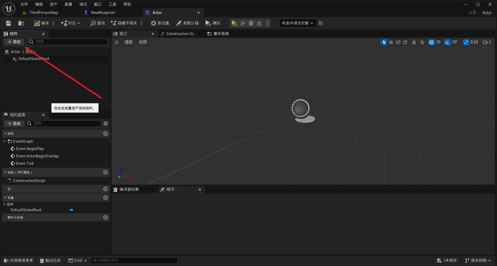
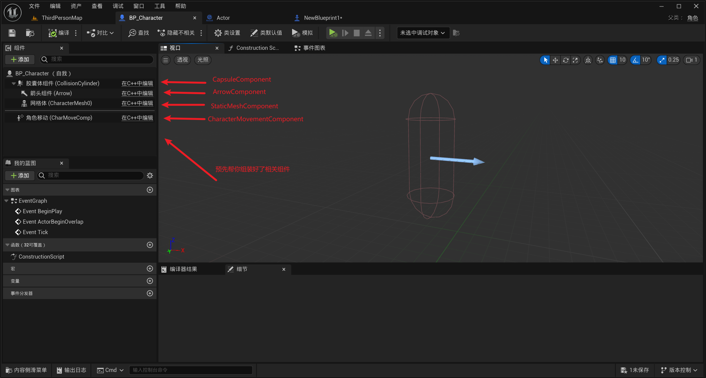
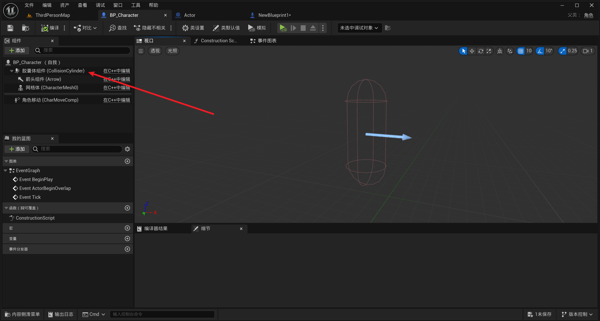
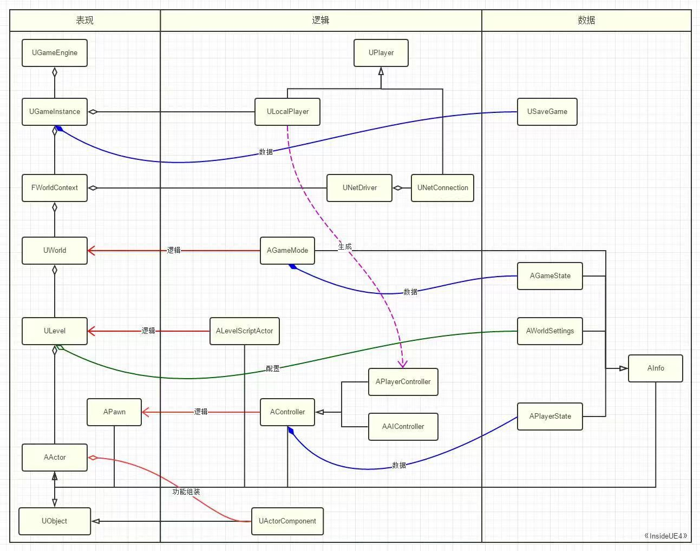

# UE基础 - 基本类
> 本页面由[杨杰翔](../../社团介绍/成员.md)编写并发布

UE为我们提供了非常非常多的预制类，盲目的去了解显然不是一个好主意。在学习的初期，我们需要做的是抓住其中最核心的几个基类进行学习，它们同样是我们在开发中会经常遇到的类，了解好它们各自的功能，能够帮我们更好地理解其他的类。

本文主要介绍以下几个类：
1. UObject
2. AActor
3. APawn
4. ACharacter
5. AController
6. UActorComponent
7. USceneComponent

## UObject类：
虚幻中最基本的类，在虚幻引擎中几乎所有的类都继承自UObject。
UObject的核心功能有以下几个：

- GC垃圾回收
- 反射
- 序列化与持久化
- 编辑器和蓝图支持
- 网络复制

除了这些还有许多虚幻的特性也是在UObject中实现的，但它本身并不能具备空间位置，不能直接放置在游戏世界中。

## AActor类:
继承自UObject，拥有UObject的所有功能，是放置在关卡中最基本的对象，几乎所有能放置在关卡内的实体都是Actor及其子类。

但实际上Actor最大的特点是其可以挂载组件。组件是一个个的功能模块，每一个组件可以实现特定的功能。

    <small>继承自Actor的蓝图类，可以添加组件</small>

在Actor中挂载不同的组件就可以获得不同的功能，比如挂载上 StaticMeshComponent , Actor 就有了一个静态的模型可以被渲染；挂载上 CameraComponent ， Actor 上就有了一个摄像机；Actor 放置在关卡中，它的空间位置和变换也是由 SceneComponent 来决定的，通常 Actor 会自带一个默认的  SceneComponent 作为 RootComponent 。

如果你要创建的类需要有挂载组件的功能，则应该继承Actor类

## APawn类：
Pawn前面的A代表着Pawn继承自Actor类，即Pawn拥有Actor所有的功能，而Pawn最大的特点是可被“操作”，具体而言是可以被Controller操控，这个Controller可以是玩家，也可以是AI。

## ACharacter类
Character继承自Pawn，它也能够被Controller操控，Character类的特点是预先准备好了游戏中角色会用到的功能，比如说CharacterMovementComponent，这个组件提供了移动和跳跃的能力，还有SkeletalMeshComponent，这个组件可以让Character拥有一个“身体”（骨骼网格体）。

    <small>oh上面打错了不是StaticMeshComponent是SkeletalMeshComponent</small>

如果你需要制作一个人物或者是一个小怪，则可以继承Character类

## AController类
继承自Actor，前面提到过，Controller类可以用来操控Pawn和Character，它是漂浮在Pawn/Character之上的灵魂，操控着肉体（Pawn/Character）的各种行为，这个灵魂可以是玩家（PlayerController子类），也可以是AI（AIController子类）。

## UActorComponent类：
由前缀U可以看出它继承自UObject类，ActorComponent一般是用来实现一些逻辑功能，它没有Transform，如果你想要创建的功能模块不需要位置信息，则可以继承ActorComponent。

## USceneComponent类：
继承自UActorComponent类，具有位置信息（Transform），同时还可以实现SceneComponent的互相嵌套

    <small>还是这张图，上面的胶囊体组件就是继承自SceneComponent，所以其可以嵌套其他也继承自SceneComponent的组件</small>

## 总结:
本文主要介绍了虚幻中最核心的七个类及其基本功能，其他预制类几乎都继承自它们，而我们在实际的游戏开发中也会创建很多我们自己的类，这就需要我们根据我们的功能需求，选择合适的类进行继承。

如果你想了解更多的内容，推荐阅读大钊老师编写的[《InsideUE4》](https://zhuanlan.zhihu.com/p/22813908)系列，该系列对虚幻的GamePlay架构进行了拆解，除了我上面提到的这些，还介绍了Level、World等在实际开发中也十分重要的类，强烈推荐。

    <small>这张是虚幻Gameplay架构里的关键类及其关系</small>
