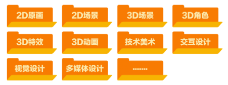

# Unity 美术基础 

> 本页面由[胡嘉悦](../../社团介绍/成员.md)于 2025.10.6 编辑并发布

## 游戏美术的细分方向

--- 

某游戏厂商2025的**美术**训练营开设了以下方向：

如果你和我一样对技术美术感兴趣，以下是一些经典的入门教程:

- [Technical Art 技术美术会做什么_Youtube](https://www.youtube.com/watch?v=kr7XYXMM7-U)
- [《Unity Shader入门精要》源代码](https://github.com/candycat1992/Unity_Shaders_Book)
- [Catlike Coding - Unity C# 和着色器教程](https://catlikecoding.com/unity/tutorials/)
- [GAMES101-现代计算机图形学入门-闫令琪_bilibili](https://www.bilibili.com/video/BV1X7411F744/?spm_id_from=333.337.search-card.all.click&vd_source=b494db6c8f6cf9d675a0cca5dde89df7)
- [技术美术百人计划_bilibili](https://www.bilibili.com/video/BV1L54y1s7xw/?spm_id_from=333.337.search-card.all.click&vd_source=b494db6c8f6cf9d675a0cca5dde89df7)  

## 如何获取游戏资产？

--- 
购买版权

- [Unity Asset Store](https://assetstore.unity.com/zh-CN?srsltid=AfmBOoqexUib0mwMfVMloLWP7TMps4OkOqt9UkBQMSzJ_g02k-QoA-_c&utm_source=chatgpt.com) Unity官方商城

- [Sketchfab](https://sketchfab.com/Emerald_Eel/collections/free-game-assets-d7263076d3b043a296321b8085a723d9?utm_source=chatgpt.com) 模型

使用免费开源资产

- [OpenGameArt.org](https://opengameart.org/) / [Kenney](https://kenney.nl/assets)  资产包
- [ambientCG](https://ambientcg.com/) / [CC0 Textures](https://cc0-textures.com/) 材质贴图
- [Poly Haven](https://polyhaven.com/hdris) HDRI 贴图
- [Freesound](https://freesound.org/) 音频

也可以自己制作

## 模型、材质、贴图的导入与设置

--- 
下文主要整理了一些教程的链接，这些教程的原文内容详尽清晰，这里就不再重复阐述，仅在部分章节中补充了一些的实践笔记。

### [从 DCC 软件导入模型的流程](https://blog.csdn.net/weixin_43147385/article/details/124880331#:~:text=,1.%E5%88%B6%E4%BD%9C%E5%B9%B6%E5%AF%BC%E5%87%BA%E6%A8%A1%E5%9E%8B%EF%BC%8C%E4%BB%A5%E5%8F%8A%E8%AE%BE%E7%BD%AE%E5%8F%82%E6%95%B0)
    
如果模型需要从DCC软件（blender、3DMax）导出为FBX，再导入Unity，可以参考这篇教程。
### [Unity模型导入面板和材质面板讲解](https://blog.csdn.net/qq_36303853/article/details/134863228#:~:text=match%20at%20L162%20albedo%2FbaseColor%E5%92%8Cnormal%E8%B4%B4%E5%9B%BE%E5%A4%A7%E5%AE%B6%E5%BA%94%E8%AF%A5%E9%83%BD%E7%9F%A5%E9%81%93%EF%BC%8C%E5%88%86%E5%88%AB%E6%98%AF%E7%BA%B9%E7%90%86%E8%B4%B4%E5%9B%BE%E5%92%8C%E6%B3%95%E7%BA%BF%E8%B4%B4%E5%9B%BE%E3%80%82%20AO%2FOcclus%E3%80%81metallic%E8%B4%B4%E5%9B%BE%E4%B9%9F%E6%AF%94%E8%BE%83%E7%AE%80%E5%8D%95%EF%BC%8C%E5%9C%A8standard%E7%9A%84shader%E7%9A%84Occlusion%E5%92%8CMetallic%E5%A4%84%E6%B7%BB%E5%8A%A0%E5%8D%B3%E5%8F%AF%E3%80%82,Image%3A%20%E5%9C%A8%E8%BF%99%E9%87%8C%E6%8F%92%E5%85%A5%E5%9B%BE%E7%89%87%E6%8F%8F%E8%BF%B0%20%E8%A1%A5%E5%85%85Emissive%E8%87%AA%E5%8F%91%E5%85%89%E8%B4%B4%E5%9B%BE)
当资源包中已包含贴图与 FBX 模型时，可参考这篇文章完成 FBX 导入设置，并了解如何在 Unity 中将贴图分配至材质的相应通道。

>观察你下载的FBX的贴图名称，如果是 Base Color（基础色）、Metallic (金属度)，在材质面板选择Metallic金属度工作流，如果是 Diffuse（漫反射）、Specular（高光），选择Specular金属度工作流。
>

>为了节约空间，smoothness一般通过读取其他贴图的A通道获得而不是使用一张单独的贴图
>

### [Unity的贴图设置面板讲解](https://blog.csdn.net/2401_83878847/article/details/145796147#:~:text=)
一张贴图通常包含 RGBA 四个通道，不同类型的贴图会在各通道中存储不同的信息，解读方式也对应不同。阅读这篇文章可以帮助你理解并正确设置贴图参数。

>
>- 法线贴图的TextureType 要设置为Normal Map
>- 什么时候需要勾选sRGB?
>  - 颜色类贴图 → 需要，是看见的物体颜色，如基础色Basecolor / Albedo / Diffuse、自发光颜色Emission
>  - 数据类贴图 → 不需要，是参与计算的物理值，如金属度、AO等
> - 草、头发等透明贴图，由Alpha 控制可见与透明区域，建议勾选 Alpha Is Transparency

## 灯光、雾效设置与后处理

--- 

### [Unity灯光官方文档](https://docs.unity3d.com/cn/2021.2/Manual/UsingLights.html)

在Hierarchy面板右键，或者菜单 **GameObject > Light** 中选择所需类型的灯光（例如 Directional Light 平行光、Point Light 点光源等），然后将光源放置在场景中合适的位置即可。

在简单场景中，实时光照（Realtime Lighting）已经足够；但当你开始追求**更高的性能或更真实的光照效果**时，就需要了解以下系统：

- **烘焙光照（Baked Lighting）**：将静态物体的光照提前计算并存储，显著提高性能。
- **光照探针（Light Probe）**：用于让**动态物体**（会移动的角色、道具）在烘焙场景中也能获得环境光照的影响。
- **反射探针（Reflection Probe）**：为物体提供**环境反射**，例如金属表面或玻璃的镜面感。

### Unity的天空盒和雾效

1. 顶部 window → Rendering → Lighting 打开 **Light** 设置面板
   &emsp;
2. 选择 **Environment** 选项卡，可以在这里设置HDRI天空盒及Fog雾效
   &emsp;
3. 请确保在Scene窗口顶部勾选了Fog的预览图层
   &emsp;

### [Unity后处理详解](https://aiferu.xyz/archives/65.html)

这篇文章详细介绍了如何在Unity开启后处理效果，已经每个后处理功能对应的效果（需要在国内IP访问）。

后处理（Post-Processing）指在渲染完成后，整体调整最终画面的光感、色彩和氛围（类似滤镜）。

**最常用的后处理是 Tonemapping + Bloom**

Tonemapping —— 把场景中的**HDR 高动态亮度**压缩到显示设备的**0–1 范围**，防止过曝，同时保持亮暗层次，颜色更“电影化”。

**几乎所有使用 HDR 光照或 Bloom 的项目都建议开启！**

>Tonemapping中 的 ACES、Filmic、Neutral 等曲线都会非线性地压缩亮部、抬暗部，所以强烈建议在**项目初期就启用目标Tonemapping曲线**，在开启的基础上再进行其他曝光和颜色的调整。

Bloom（泛光 / 光晕）—— 在明亮区域（如灯光、反射、水面、霓虹）周围产生柔和光晕，需要在URP设置和相机设置中开启HDR

## Unity UGUI

---
### 推荐阅读[Unity UI 官方文档](https://docs.unity3d.com/cn/2021.1/Manual/UIBasicLayout.html)

### Canvas 自适应

导出的游戏可能会在不同尺寸的屏幕下显示，所以需要选择适配方式
> 
> 推荐在Canvas下使用 Canvas Scale 中的 Scale With Screen Size 模式，并设置为 1920 x 1080。
> 
> 
或者参考这篇文章[Unity Canvas Scaler 组件实现UI自适应](https://blog.csdn.net/hello_1995/article/details/122130097#:~:text=Canvas%20Scaler%20%E8%BF%99%E4%B8%AA%E7%BB%84%E4%BB%B6%E7%94%A8%E6%9D%A5%E5%81%9A%E6%95%B4%E4%BD%93%20UI%20%E5%B1%8F%E5%B9%95%E9%80%82%E9%85%8D%E7%9A%84%E3%80%82%E4%B8%BA%E4%BB%80%E4%B9%88%E6%98%AF%E6%95%B4%E4%BD%93%E9%80%82%E9%85%8D%EF%BC%9F%E5%9B%A0%E4%B8%BA%E9%80%82%E9%85%8D%E6%97%B6%E8%BF%98%E4%BC%9A%E7%94%A8%E5%88%B0,Canvans%20%E6%B8%B2%E6%9F%93%E6%A8%A1%E5%BC%8F%E4%B8%BA%20World%20Space%20%E6%97%B6%EF%BC%8C%E7%BC%A9%E6%94%BE%E6%A8%A1%E5%BC%8F%E5%8F%AA%E6%9C%89%E4%B8%80%E7%A7%8D%E3%80%82)
> 
> 应该在UI排版初期就考虑好画布大小和自适应方式，以免出现因为调整屏幕大小比例UI满屏乱飞的情况。

在Game窗口可以改变预览的屏幕尺寸：

 

## 其他

### 在Unity内构建3D关卡原型：ProBuilder插件

- [ProBuilder 官方文档](https://docs.unity3d.com/Packages/com.unity.probuilder@4.0/manual/overview-ui.html)
- [Pro Builder 使用教学_youtube](https://www.youtube.com/watch?v=qV2o1D1uWgE&t=715s)

### [在 Unity 中使用排序图层（Sorting Layer）](https://gamedevbeginner.com/how-to-use-sorting-layers-in-unity/#:~:text=To%20add%20more%2C%20simply%20click,of%20layers%20at%20the%20top)
在 2D 项目中，当多个元素重叠时可能出现前后层级显示不正确的情况。这篇文章系统介绍了如何通过 Sorting Layer 调整素材的渲染层级。

