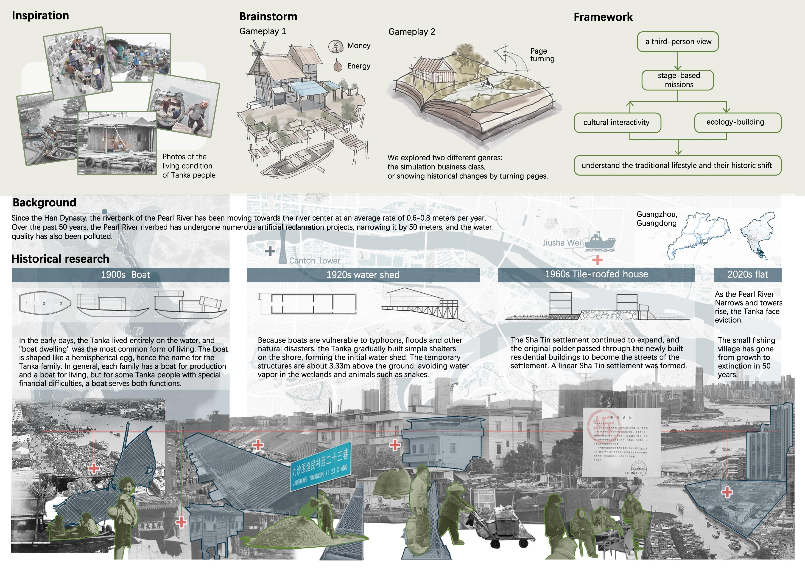
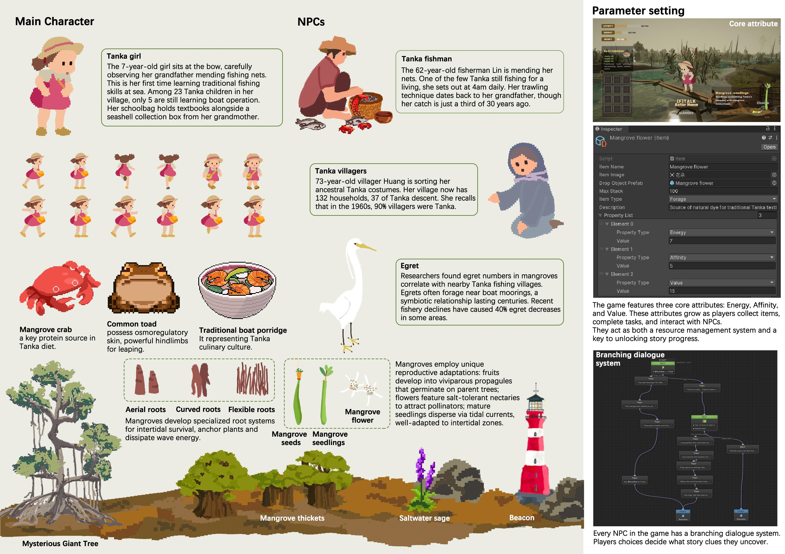
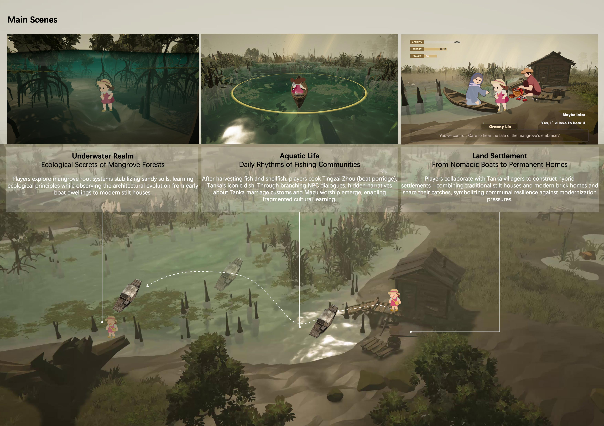
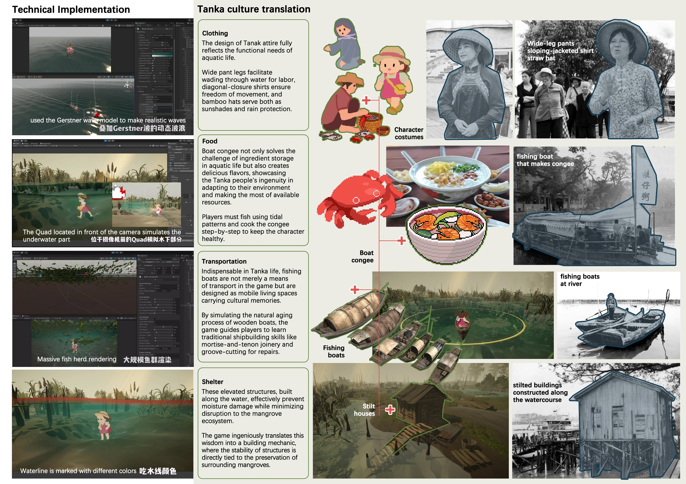

# 项目展示
> 本页面由[胡嘉悦](../社团介绍/成员.md)编辑并发布
## 《浮生之路》项目介绍
《浮生之路》以一位疍家女孩的成长经历为线索，带领玩家走进“水下沙田—水上渔船—岸上新居”的生活变迁旅程。玩家将在游戏中亲手种植红树林、搭建船屋、参与妈祖祭典等互动任务，感受疍民代代相传的生态智慧与生活技艺。作为一款融合文化传承与现代互动的作品，《浮生之路》希望以游戏的语言，重新激活那些正在消逝的滨水记忆与故事。
### 故事灵感

    <small>项目灵感来自珠江上的疍民，他们世代以船为家，从红树林水域一路走向现代城市。随着环境与社会的变迁，他们的生活方式逐渐改变。游戏以这些真实的历史故事为背景，引导玩家在任务和剧情中重温这段独特的文化记忆。</small>

### 角色与玩法设定

    <small>玩家将扮演一名正在学习捕鱼的小女孩，和渔民、村民、白鹭等角色交流。通过捕鱼、烹饪、收集与对话，你可以一步步解锁疍民的故事与传统。游戏设计了“能量、亲和力、价值”三大属性，让每一个选择都影响你的冒险进程。</small>

### 场景设计

    <small>游戏中包含三个核心场景：水下世界、渔猎生活和村落建造。你可以潜入红树林探秘生态，在小船上烹饪传统的艇仔粥，或与村民一起搭建疍家棚屋。</small>

### 开发探索

    <small>游戏结合真实的水体模拟与鱼群渲染技术，还原波浪、潮汐和水下景观。同时把疍民的服饰、饮食、船只与房屋转化为可玩的内容。在轻松探索中，感受到他们的生活智慧与文化底蕴。</small>

### 《浮生之路》项目PV

  <iframe 
      src="//player.bilibili.com/player.html?isOutside=true&aid=114550284226431&bvid=BV1jmJJzDEEr&cid=30088626549&p=1" 
      style="width: 100%; height: 562px;" 
      frameborder="no" 
      allowfullscreen="true">
  </iframe>

> **开发队员**  
> 程序：胡嘉悦  
> 策划：毛秋驰  
> 美术：梁韵亭 林焕霖

